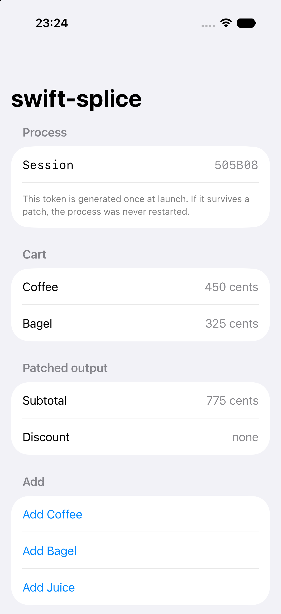
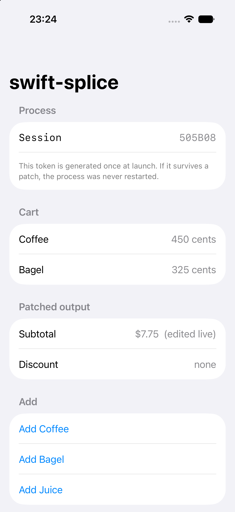

# CounterApp

A SwiftUI iOS Simulator app wired to swift-splice end to end. Save a method
body in `Sources/Cart.swift` and the running app changes.

| before | after |
| --- | --- |
|  |  |

The session token is generated once at launch and is identical in both. That
is the point: the process was never restarted, the `Cart` instance and its
items are the same objects, and only the patched row changed.

```
Session    505B08      ->  505B08      (unchanged)
Subtotal   775 cents   ->  $7.75  (edited live)
```

## Running it

Boot a simulator, then:

```
./demo.sh
```

That builds the app, launches it, starts the daemon, edits `subtotalLabel()`,
screenshots both sides, and puts the source back.

To drive it by hand instead, which is the point of the thing:

```
./build.sh
swift-splice watch --context splice-context.json
```

Then edit a method body in `Sources/Cart.swift` and save.

## What each piece is

```
Sources/Cart.swift      the subject: stored properties plus patchable methods
Sources/App.swift       SwiftUI views that call those methods
Patches/                hand-authored replacements, for the manual path below
build.sh                assemble the bundle, install, launch, emit the context
patch.sh                compile a hand-written patch, for debugging
demo.sh                 the whole loop, unattended
```

The runtime lives in `runtime/` at the repository root, not here. `build.sh`
compiles it into the app module.

There is no Xcode project. The bundle is assembled by `build.sh` so that every
flag the design documents argue about is visible in one place rather than
buried in a `.pbxproj`. Real projects will get these through xcconfig, which is
`DESIGN.md` section 5.2's problem, not this example's.

### The build settings that matter

```
-Onone                                 keep replacement dispatch intact
-Xfrontend -enable-implicit-dynamic    make declarations replaceable
-enable-testing                        export the replacement keys
-D SPLICE_ENABLED                      compile in the runtime
```

`-enable-testing` is the one that is easy to miss. Without it the replacement
keys exist but stay hidden, and a patch cannot bind to them at all. See
`DESIGN.md` section 5.4.

### splice-context.json

`build.sh` writes the compiler invocation the daemon needs in order to build a
patch the running binary can load: target, SDK, module search paths, and the
app binary to link against. Emitting it from the build that produced the binary
is the version that cannot drift. Recovering the same thing from an Xcode build
is `DESIGN.md` section 6.2's problem.

The daemon refuses to patch a process whose build identity does not match the
sources being watched, so a stale app produces a message rather than a
corrupted heap.

### How a patch is built

```
swiftc -Onone -emit-library
       -I <dir with CounterApp.swiftmodule>
       -Xlinker -bundle
       -Xlinker -bundle_loader -Xlinker <the app binary>
```

Linking against the application binary means an unresolvable replacement key
fails at LINK with `Undefined symbols` rather than inside the running process
at `dlopen`. `-undefined dynamic_lookup` would defer the same failure and is
deprecated for the iOS Simulator besides.

## Trying the rejection path

Add a stored property to `Cart` while the daemon is watching:

```
[CLASSIFY] Cart.swift
the set of declarations changed: added Cart.taxCents

Action: full rebuild required.
```

Nothing is compiled and nothing is sent. The classifier stops at the first
stage because the running objects were allocated with the old layout.

## Release isolation

```
$ ./build.sh --release
configuration      release
replacement keys   0 exported
release isolation  OK (no keys, no runtime)
```

The build fails if the binary exports any replacement key or still contains the
runtime, which is the check `DESIGN.md` section 5.3 asks for.

## The manual path

`patch.sh` compiles a hand-written patch from `Patches/` and drops it in the
app's inbox; the "Load pending patches" button in the app loads it. This is how
M1 worked, before there was a daemon. It is kept because it is the shortest way
to test a replacement without involving the generator.
